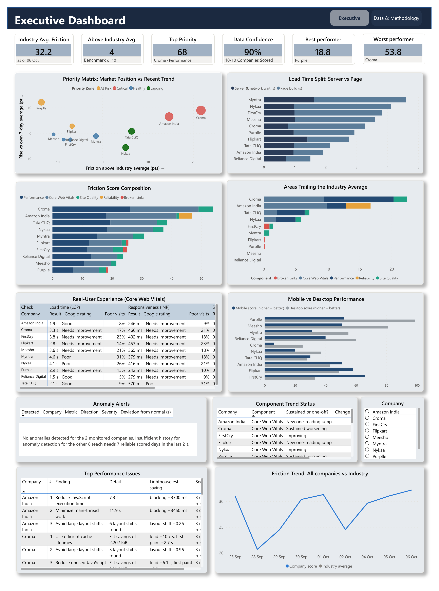
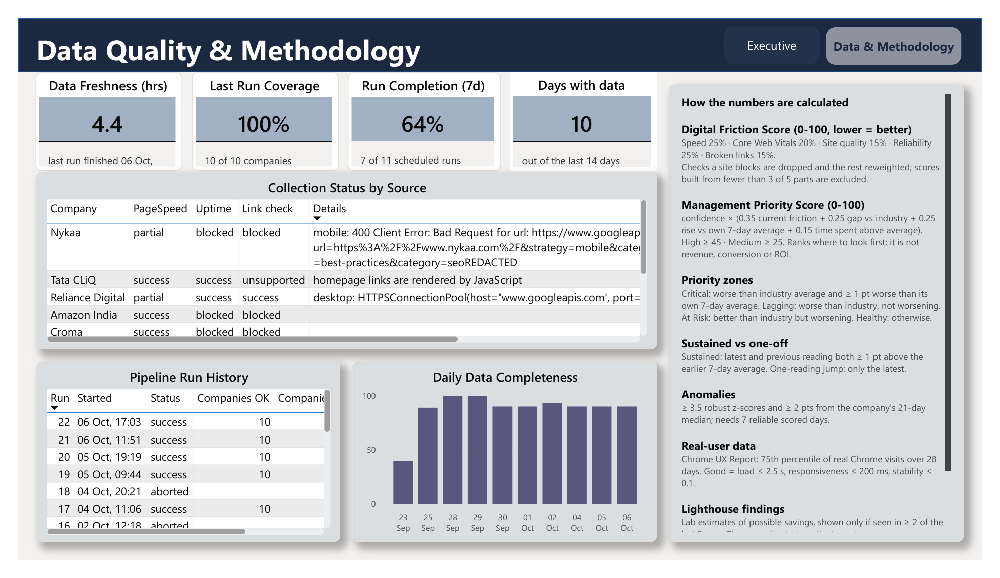

# Digital Friction Score: Indian E-commerce Benchmarking

How hard is it to shop on India's biggest e-commerce sites, and who is getting
better or worse?

This project answers that with an automated pipeline. Every 12 hours it
collects public digital-experience data for 10 Indian e-commerce companies,
turns it into a single explainable **Digital Friction Score**, flags unusual
changes and ranks where to look first. A Power BI dashboard sits on top.

Everything runs on free tools: Python, a local PostgreSQL database, Power BI
Desktop and Windows Task Scheduler.

## How it works

```
Google PageSpeed Insights API ─┐
Uptime checker                 ├─▶ Python collectors ─▶ PostgreSQL ─▶ SQL views ─▶ Power BI
Broken-link checker           ─┘   (Windows Task Scheduler, every 12 hours)
```

Each run:

1. **Collects** three kinds of data for every company:
   - a Google Lighthouse test (mobile and desktop) plus real-user Chrome UX
     Report data, both from the PageSpeed Insights API
   - a direct homepage availability and response-time check
   - a check of up to 40 same-site links on the homepage for broken ones
2. **Stores** the results in PostgreSQL, with a JSON copy of each company's raw
   data in `data/raw/<date>/` as an audit trail.
3. **Scores** each company for the day (India time) and compares the new score
   with that company's own history to detect anomalies.
4. **Records** the outcome of every source for every company, so the dashboard
   can show how complete and fresh the data is.

All the analysis lives in SQL views, and Power BI reads those views directly.

## Companies tracked

Flipkart, Myntra, FirstCry, Nykaa, Meesho, Purplle, Tata CLiQ, Amazon India,
Reliance Digital and Croma.

The list lives in `config/companies.yaml`. A company removed from it is marked
inactive and its history is kept.

## The dashboard

The Power BI report has two pages.

### Executive Dashboard



- **Headline KPIs**: industry average friction, how many companies are above
  it, the top priority company and its main problem area, data confidence,
  and the best and worst performer.
- **Priority Matrix**: each company's friction relative to the industry
  average against its change from its own 7-day average, coloured by priority
  zone.
- **Load Time Split**: real-user load time divided into server wait and page
  build, showing whether slowness is a server problem or a page problem.
- **Friction Score Composition**: what each company's score is made of.
- **Areas Trailing the Industry Average**: the components where each company
  is worse than the industry.
- **Real-User Experience**: Google's Core Web Vitals from real Chrome users,
  with Google's rating and the share of poor visits.
- **Mobile vs Desktop Performance**: Lighthouse performance score by device.
- **Anomaly Alerts**, **Component Trend Status** (sustained vs one-off
  changes), **Top Performance Issues** (Lighthouse's recurring findings) and
  **Friction Trend**. The company slicer filters these four visuals only.

### Data Quality & Methodology



Data freshness, last-run coverage, run completion over 7 days, days with data,
collection status per company and source, run history, daily data
completeness, and a summary of how every number is calculated.

Opening and refreshing the report is covered in
[powerbi/SETUP_GUIDE.md](powerbi/SETUP_GUIDE.md).

## Digital Friction Score

A score from 0 to 100 where **higher means more friction**, so lower is better.
It is a weighted sum of five components, each first converted to a 0-100
friction scale:

| Component | Weight | Based on |
|---|---|---|
| Performance | 25% | Lighthouse performance score (60% mobile, 40% desktop) |
| Core Web Vitals | 20% | LCP, CLS and a lab responsiveness measure, scored against Google's good/poor thresholds |
| Site Quality | 15% | Lighthouse accessibility, best-practices and SEO scores |
| Reliability | 25% | Uptime plus a penalty for slow server responses |
| Broken Links | 15% | Share of checked homepage links that are broken |

Because it is a plain weighted sum, every score splits exactly into
per-component contributions. If a component can't be measured for a company,
it is left out and the other weights are scaled up, so a site is never
rewarded for being unmeasurable. A score counts as reliable only when at least
3 of the 5 components were measured (60% data completeness). The formula is in
`collectors/scoring.py`.

## Management Priority Score

A 0-100 score that ranks **where to look first**. It is a prioritisation aid:
it does not estimate revenue, conversion or customer loss, and it makes no
causal claims.

```
Priority = Confidence × (0.35 × Severity + 0.25 × Gap + 0.25 × Deterioration + 0.15 × Persistence)
```

| Signal | Meaning (each scaled to 0-100) |
|---|---|
| Severity | The company's latest reliable friction score |
| Gap | How far it is above the industry average (20+ points above = 100) |
| Deterioration | How much worse it is than its own 7-day average (10+ points worse = 100) |
| Persistence | Share of its readings in the last 14 days that were above the industry average |
| Confidence | 0.5 + 0.5 × data completeness × min(1, readings in last 21 days ÷ 7) |

Deterioration compares against a 7-day average rather than the previous
reading, because single Lighthouse runs are noisy.

Scores of 45 and above are High priority, 25 to 45 Medium. The priority
matrix places each company in one of four zones:

| Zone | Rule |
|---|---|
| Critical | Worse than the industry average and at least 1 point worse than its own 7-day average |
| Lagging | Worse than the industry average, not getting worse |
| At Risk | Better than the industry average but getting worse |
| Healthy | Neither |

The logic is in `sql/views_management.sql`.

## Anomaly detection

Each new score is compared with the median of that company's reliable scores
from the previous 21 days, using a robust z-score (median and MAD, which a
single bad run can't distort). A change is flagged only when it is at least
3.5 robust z-scores **and** at least 2 points away from the median.

A company is monitored once it has 7 reliable days of history. Until then the
dashboard shows how many companies are still building a baseline.

## Getting started

You need Python 3 (developed on 3.14), PostgreSQL and Power BI Desktop. The
scheduler script is for Windows.

1. **Install the Python packages**
   ```
   pip install -r requirements.txt
   ```

2. **Get a free PageSpeed Insights API key.** In the
   [Google Cloud console](https://console.cloud.google.com/apis/credentials),
   enable the *PageSpeed Insights API* for a project and create an API key. No
   billing account is needed.

3. **Add your settings.** Copy `.env.example` to `.env` and fill in your
   PostgreSQL password and the API key. `.env` is git-ignored.

4. **Create the database, tables and views**
   ```
   python scripts/setup_db.py
   ```

5. **Run the pipeline once**
   ```
   python -m collectors.orchestrator
   ```
   This loads the company list from `config/companies.yaml`, then collects and
   scores. A full run takes about 20 to 50 minutes, because Lighthouse tests
   are slow and requests are spaced out politely. Progress is written to
   `logs/pipeline.log`.

6. **Schedule it** (optional). In PowerShell:
   ```
   .\scripts\register_task_scheduler.ps1
   ```
   This registers a Windows scheduled task that runs the pipeline every
   12 hours, and runs it as soon as possible if the PC was off at the
   scheduled time. Use `-IntervalHours` to change the interval.

7. **Open the dashboard** and click **Refresh**. See
   [powerbi/SETUP_GUIDE.md](powerbi/SETUP_GUIDE.md).

## Tests

```
python -m unittest discover -s tests -v
```

The tests recompute the key numbers independently in Python and check that the
SQL views agree:
- the friction-score breakdown, the priority score, tiers and zones
- component gaps and trend status
- real-user metrics, the load time split, the mobile/desktop comparison and
  the Lighthouse findings

They also unit-test the anomaly rules and check that anomaly readiness matches
the detection window. The tests read from the local database
and don't change anything.

## Project structure

```
collectors/          Data collection, scoring and anomaly detection (Python)
  orchestrator.py    Entry point for one pipeline run
config/              Companies to track
sql/                 Database schema and analytical views
scripts/             Database setup and Task Scheduler registration
tests/               Checks of the SQL views against independent calculations
powerbi/             Power BI project (report and data model, saved as text)
images/              Dashboard screenshots
```

## Limitations

- **Some sites block automated requests.** This is recorded as "blocked", not
  "down", and the pipeline doesn't try to get around it. For those sites,
  reliability comes from Google's Lighthouse test instead (whether it could
  load the page, and the server response time). The broken-link component
  can't be measured for them.
- **The link check reads the page HTML only.** Sites that build their homepage
  links with JavaScript (currently Tata CLiQ) are marked "unsupported" for
  broken links.
- **The responsiveness measure in the score is a lab proxy.** Lighthouse can't
  measure real Interaction to Next Paint (INP). The real-user INP figure comes
  from Chrome UX Report data and is shown separately.
- **The server vs page load split is approximate.** It subtracts one 75th
  percentile from another, and percentiles don't add up exactly.
- **Baselines need history.** Anomaly detection, 7-day comparisons and
  confidence all improve as more days are collected.
- **Rankings are relative.** A High priority company is the first place to
  look, not proof of a business problem.
- **Refresh is manual.** Power BI Desktop pulls new data when you click
  Refresh.

## License

Released under the [MIT License](LICENSE). The data comes from public sources:
Google's PageSpeed Insights API and the companies' public homepages.
